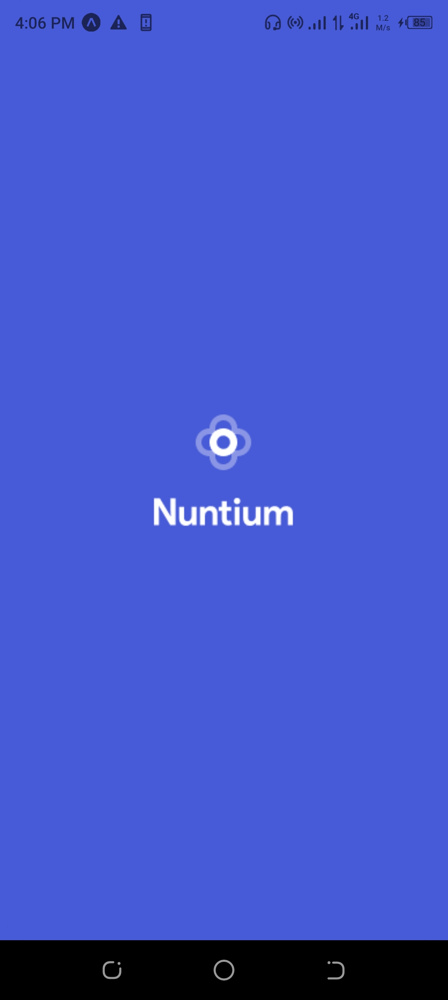
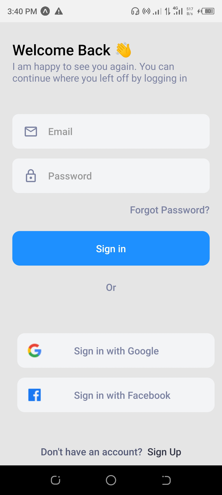
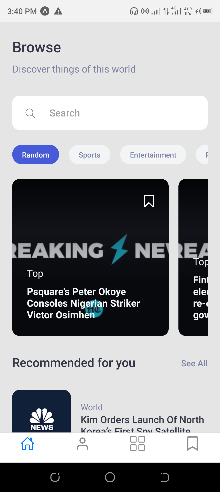
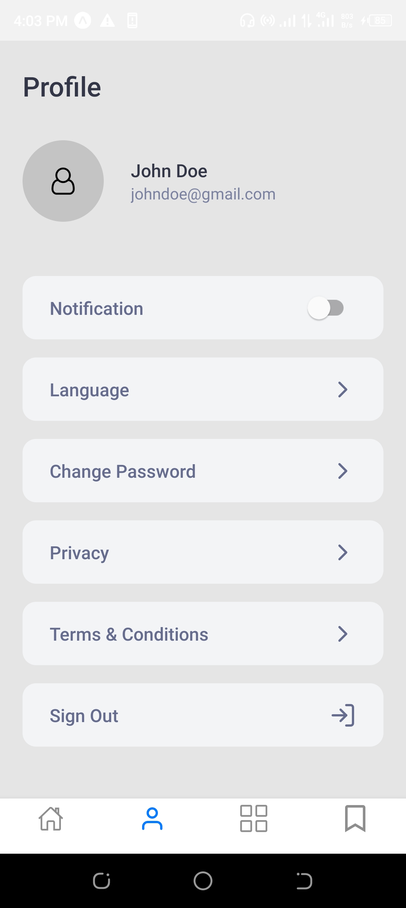

# Nuntium News App

A news app that allows users to register, login and read and bookmark news for later read. This project was built using React native expo and nativewind(TailwindCSS). the news data displayed on the app was retrieved from [`New api`](https://newsdata.io/api)

check out the live preview on expo [`here`](exp://exp.host/@dannypreye/news_app?release-channel=default)

## Screenshots

Splash screen

onboading screen

login screen

home screen

News screen

Profile screen

## Getting Started

run this command on your terminal to clone the repo
`git clone https://github.com/DannyPreye/Nuntium_news.git`

cd into the directory and run
`npm install` to install all the dependencies
